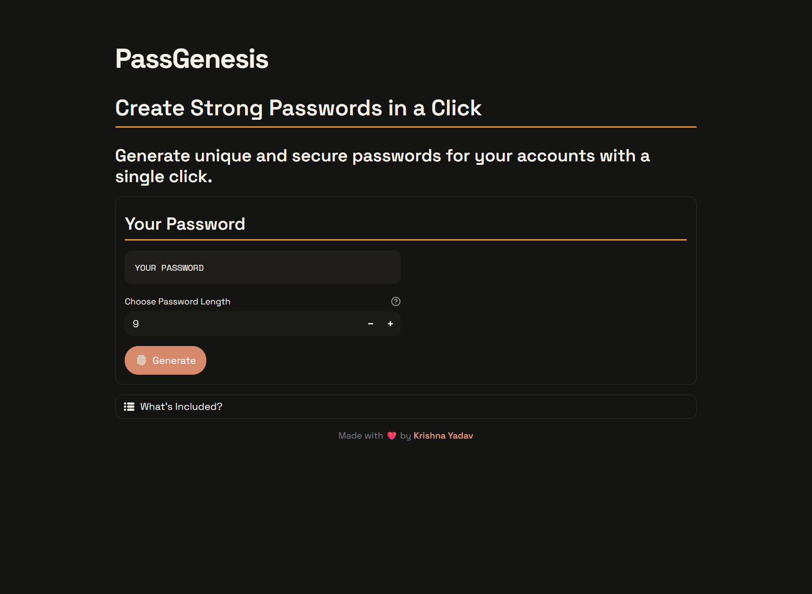
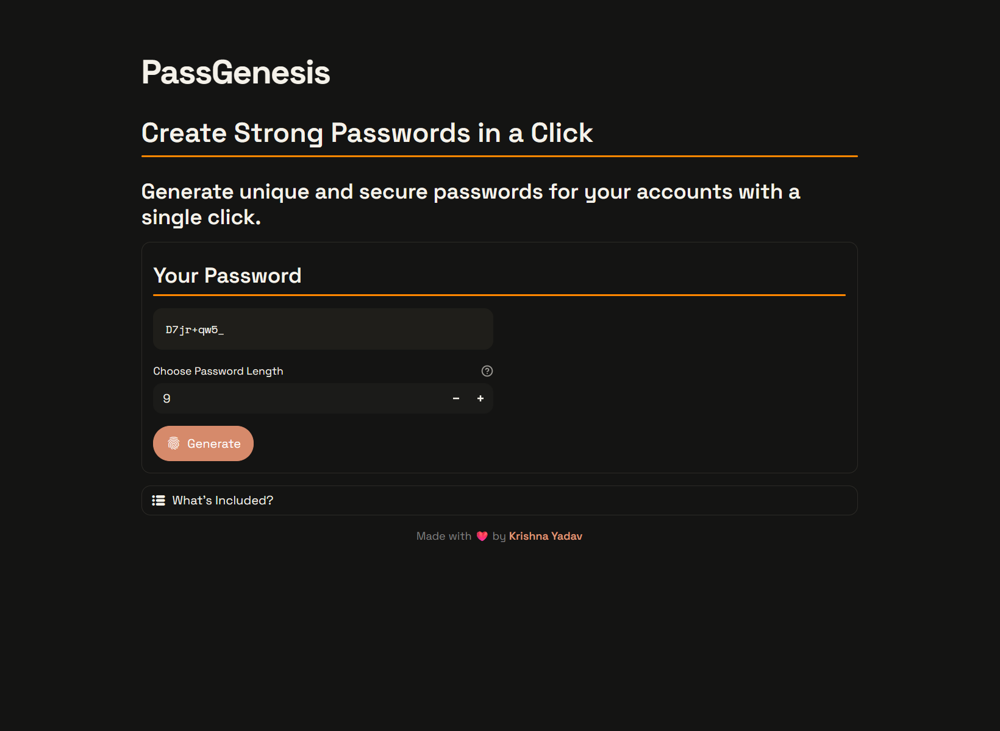
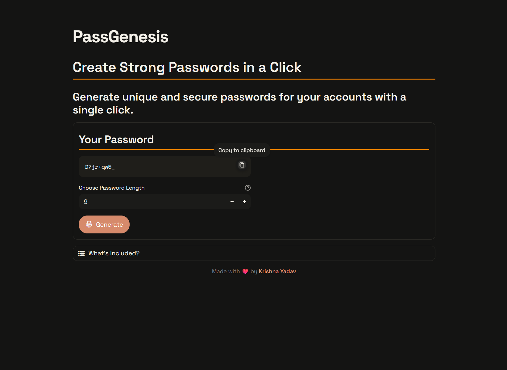

<p align="center">
  
</p>

---

<div align="center">

Generate strong, secure, and unique passwords in seconds.

Built with **Streamlit** • Secure • Privacy-First

[](https://www.python.org/)
[](https://passgenesis.streamlit.app/) <br>
[](https://streamlit.io/)
[](./LICENSE)

</div>

---

## Overview

PassGenesis is a lightweight password generator built with **Python + Streamlit** that generates secure passwords instantly through a clean and minimal interface.

The application focuses on three principles:

* **Security** → Uses cryptographically secure randomness
* **Privacy** → No password storage or transmission
* **Simplicity** → One click to generate

Passwords are generated locally during the active
session and disappear when the session ends.

---

# ✨ Features

* Generate strong passwords instantly
* Adjust password length (4–18)
* Uses widely compatible charset
* Responsive layout
* No storage or transmission
* No database or analytics

---

# 📸 Screenshots

## Home Screen

Minimal and distraction-free experience.

<p align="center">
  
</p>

## Generated Password

Generate strong passwords instantly.

<p align="center">
  
</p>

## Copy Password

Copy generated passwords in one click.

<p align="center">
  
</p>

---

# 🧰 Tech Stack

| Layer               | Technology              |
| ------------------- | ----------------------- |
| Core Language       | Python                  |
| Frontend            | Streamlit               |
| Security            | `secrets`               |
| Character Utilities | `string`                |
| State Management    | Streamlit Session State |

---

# 🔐 Password Composition

Generated passwords are created using a randomized mix of:

* Lowercase letters (`a-z`)
* Uppercase letters (`A-Z`)
* Numbers (`0-9`)
* Symbols (`! @ # $ % & * _ - +`)

> [!NOTE]
> The selected character set is intentionally fixed to maintain broad compatibility across platforms and services.

---

# 🛡️ Privacy & Security

PassGenesis follows a stateless approach.

* Passwords are generated locally
* Passwords are not stored
* Passwords are not transmitted
* No account or login required
* No history retention

---

# 📂 Project Structure

```bash
PassGenesis/
│
├── .streamlit/
│   └── config.toml                 # Streamlit theme configuration
│
├── assets/
│   ├── banner.png                  # README banner (PassGenesis branding)
│   └── icon.png                    # Project/app icon
│
├── screenshots/
│   ├── copy-password.png           # Password copy state
│   ├── generated-password.png      # Password generated state
│   └── home-screen.png             # PassGenesis home screen
│
├── .gitignore                      # Ignore local/cache files
├── app.py                          # Main Streamlit application
├── LICENSE                         # MIT license
├── README.md                       # Project documentation
├── requirements.txt                # Python dependencies
└── SECURITY.md                     # Security policy
```

---

# ⚙️ Requirements

## Environment

| Requirement | Version       |
|-------------|---------------|
| Python      | 3.10+         |
| pip         | Latest stable |

## Dependencies

Dependencies are listed in:

```text
requirements.txt
```

---

# 🚀 Local Setup

Clone repository:

```bash
git clone https://github.com/kr1shna-yadav/PassGenesis.git
```

Move into project:

```bash
cd PassGenesis
```

Install dependencies:

```bash
pip install -r requirements.txt
```

Run application:

```bash
streamlit run app.py
```

Open:

```text
http://localhost:8501
```

---

# ☁️ Live Demo

<p align="center">
  
</p>
<h3 align="center">PassGenesis</h3>
<p align="center">
  Generate strong, secure, and unique passwords in seconds.
  <a href="https://passgenesis.streamlit.app/" target="_blank" rel="noopener noreferrer">
  See Live ↗
  </a>
</p>

---

# 🧠 Core Workflow

```text
User selects password length
          ↓
Generate button clicked
          ↓
Secure random generation
          ↓
Display password
          ↓
Session ends → password disappears
```

---

# 🤝 Contributing

This project is currently not accepting external contributions.<br>
Feel free to open issues for feedback or suggestions.

---

# 🔏 Security

See [SECURITY.md](./SECURITY.md) for security practices and vulnerability reporting.

---

# 📄 License

Distributed under the MIT License. See [LICENSE](./LICENSE) for details.

---

# 🙌 Acknowledgements

Built using:

* Python
* Streamlit
* Python secrets module

---

<div align="center">

Built with simplicity and privacy in mind

</div>